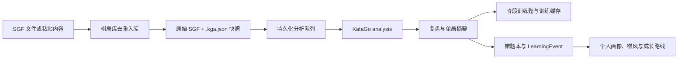

# 项目说明

> 文档版本：v5.0｜整理日期：2026-08-15｜适用目录：`D:\katago`
>
> 本文以当前代码和可运行文件为准，说明产品能力、数据流、存储位置、运行方式和验证边界。历史设计讨论保留在 `项目大纲.md`，不再与本说明混在一起。

## 1. 项目定位

这是一个运行在 Windows 本机上的个人围棋学习系统。KataGo 负责给出可追溯的局面评价；系统再把分析结果整理成棋谱库、问题手、训练、错题本和长期个人画像。

它的核心闭环是：

```text
导入本人棋谱 → 自动/批量 KataGo 分析 → 识别本人最值得学习的问题
→ 主动复盘或阶段训练 → 按实际目损评价重选 → 间隔复习
→ 后续实战验证是否仍然复发 → 更新个人学习重点
```

项目不是在线平台，也不会上传棋谱；除非用户自行配置外部教练服务，基础分析、训练和数据存储都可离线完成。

## 2. 当前组成

| 目录或文件 | 作用 |
|---|---|
| `analyzer/` | 自研 Python/Tk 桌面应用、全部业务逻辑和测试。入口是 `app.py`。 |
| `katago-runtime/` | 已打包的 KataGo Windows 引擎、模型、DLL 与示例配置。 |
| `KataGo/` | KataGo 官方源码、官方文档与训练脚本，不是本应用日常运行必需项。 |
| `analyzer/game_library/` | 用户本地棋局库与学习数据，首次运行时自动创建。 |
| `run.bat` | Windows 启动入口，优先使用 `pythonw`，其次使用 `py` 或 `python`。 |
| `README.md` | 简短入口与启动说明。 |
| `analyzer/README.md` | 分析器的功能与界面说明。 |
| `项目大纲.md` | 学习系统的设计依据、产品取舍和历史实施计划。 |

当前应用版本由 `analyzer/app.py` 的 `APP_VERSION` 统一定义，为 `5.0`。

## 3. 快速启动

最简单的方式是在资源管理器中双击 `run.bat`。

也可在 PowerShell 中启动：

```powershell
cd D:\katago\analyzer
py app.py
```

首次启动后，在“引擎/模型”设置中确认以下项目：

1. KataGo 可执行文件。
2. 神经网络模型文件。
3. 规则、贴目与复盘 `maxVisits`。
4. 训练速度和棋局库后台分析强度。

应用会尝试自动启动 KataGo。OpenCL/GPU 首次运行可能有调优等待；启动失败时可改用 CPU 引擎。训练速度与复盘深度分开配置，避免训练对弈被高 visits 拖慢。

## 4. 用户功能

### 4.1 棋盘与研究工作台

- 19 路棋盘、合法落子、提子、自杀和简单打劫判断。
- 撤回、快进、分支、自动播放、棋局树和可拖动进度条。
- 悬停落点预览、全局提示、悔棋和停一手（pass）在正常研究、训练和点目流程中均有对应处理。
- KataGo 推荐点、胜率、目差、主变和领地/策略热力映射。
- 推荐点既可在棋盘显示，也可在右侧模块中按候选按钮查看；候选数量和主变长度可配置。
- 终局点目采用中国规则面积数法，可按 ownership 提示死子，但死活标记最终仍由用户确认。

常用快捷键：`Left/Right` 上一步/下一步，`Home/End` 首手/末手，`PageUp/PageDown` 跳转十手，`Space` 自动播放，`F1` 提示，`Ctrl+Z` 悔棋，`Ctrl+P` 停一手，`Ctrl+O/S/L/R` 分别为导入、保存、棋谱库和分析当前局面。

### 4.2 复盘与对局分析

- 对主线逐节点发送 KataGo `analysis` 请求，生成胜率曲线、目损、问题手、三阶段统计与中文复盘文字。
- 三个阶段固定为布局、中盘、官子；统计会按“我方/双方”范围切换，避免把对手失误混入个人结论。
- 每手使用精细评价：最佳、好手、一般、不佳、恶手或未评价，并保存目损、胜率损失、置信度和问题标签。
- 默认聚焦少量高价值学习节点，而非把每一手都当作需要背诵的评价。
- 对严重问题手可自动做实战分支与 AI 推荐分支的同 visits 深算，对比走子方视角的目差、胜率、控制点和主变；结果可在棋盘上按编号查看。
- 可导出 Markdown 复盘报告，其中包含阶段表现、问题手、双分支对比和文字总结。

### 4.3 棋局库与批量分析

棋局库是本地文件型数据库，不依赖 SQL 服务。它负责保留原始 SGF、可继续分析的项目快照和索引数据。

- 单个导入、多选导入、粘贴 SGF，以及 `game_library/inbox/` 自动扫描。
- 以 SGF 内容的 SHA-1 建立稳定记录 ID，因此重复扫描不会重复入库，也不会覆盖已有分析缓存。
- 多盘棋进入持久化分析队列；队列可暂停、继续、重试失败任务，并在引擎中断后恢复为待运行。
- 每完成一段分析就把项目快照写回库中，正常暂停或异常中断不会丢失已完成的节点。
- 删除记录只删除库内副本、项目快照、训练缓存和相关学习数据，不删除最初导入位置的原始文件。

### 4.4 阶段训练与响应预热

系统不只抓取一手最大失误，而是在约 30 到 40 手的滑动窗口中寻找累计表现最差的阶段。训练方可以设置为我执黑、我执白或双方。

- 整盘分析完成后，棋局库自动生成最差阶段训练题。
- 后台沿训练主线预生成最多约 20 回合的候选与 AI 应手，写入独立训练缓存；这不是重新训练 KataGo 权重。
- 进入训练后优先命中缓存，用户可快速与 AI 交替落子；走出缓存分支时才按需补算。
- 训练时默认不实时打断用户思路；提示、悔棋、结束和重来均可用，完整评价在结束后统一给出。
- 训练报告比较原实战和训练中的本人走子，区分改善、重复错误和新错误，并把提示、重试等行为纳入结果解释。

### 4.5 错题本、个人画像与棋风

- 高价值问题手会同步为可重复练习的错题；复习时隐藏答案，用户重新落子后按实际目损判定，而不是简单以“AI 前三选”判对错。
- 错题本使用 `new → understanding → retained → transferred` 的掌握状态，另有 `unstable` 表示“复习会做、真实对局仍反复犯”。
- 训练或复习中再次失误只会降低巩固状态，不会冒充真实对局复发；只有新入库实战中的本人问题才会触发 `unstable`。
- 长期个人画像汇总平均目损、黑白表现、阶段弱点、问题类别、逐盘趋势、今日到期错题和优先训练项目。
- 棋风画像从八个维度统计频率、平均代价、趋势与置信度；成长路线只给一个主线目标。关键结论可进入高 visits 复核队列，复核不稳定时会降级为“继续观察”。
- 可选 Human SL 模型用于比较当前棋力档和更高棋力档对同一手的偏好；未配置该模型时系统会诚实降级，不把普通 KataGo `prior` 说成人类落子概率。

## 5. 关键工作流



### 5.1 导入到可训练

1. 导入或扫描到 SGF 后，系统创建原谱副本和空项目快照。
2. 记录进入分析队列，KataGo 按主线逐局面分析。
3. 全主线完成后，项目快照保存分析缓存；棋局索引更新分析进度、三阶段摘要、训练题和轻量画像。
4. 后台预热训练阶段的候选与 AI 应手。用户稍后进入训练时优先读取这份缓存。

### 5.2 问题手到长期学习

1. `move_quality.py` 用 KataGo 结果计算目损、胜率损失、标签和置信度。
2. `learning_priority.py` 综合严重度、历史复发、可学习性、掌握状态与错误链多样性，选出每盘重点。
3. `taxonomy.py` 将问题归为计算、死活、棋形、方向、弱棋、攻防、先后手、全局或官子，并保存分类证据。
4. `mistake_book.py` 生成间隔复习题；`learning_store.py` 写入跨棋局 LearningEvent。
5. 后续新实战进入库后，只针对该棋局的本人执棋方检查同类问题是否再次发生，从而更新掌握状态。

## 6. 数据与持久化

棋局与学习数据位于 `analyzer/game_library/`；应用设置单独保存在
`analyzer/user_settings.json`。建议定期备份两者。

| 路径 | 内容 |
|---|---|
| `inbox/` | 自动采集的 SGF 投放目录。 |
| `sgf/<id>.sgf` | 库内原始棋谱副本。 |
| `projects/<id>.kga.json` | 棋树、节点分析、评论、点目结果、复盘摘要、当前节点和分支深算。 |
| `index.json` | 棋局库索引、来源、分析进度、训练题、训练记录、画像身份等。 |
| `analysis_queue.json` | 批量整盘分析队列及任务状态。 |
| `training_cache/<id>.json` | 训练阶段的持久化应手缓存。 |
| `mistake_book.json` | 间隔复习题、到期日、作答记录和掌握状态。 |
| `learning_events.json` | 跨棋局的 LearningEvent、类别、优先级、实战迁移状态。 |
| `profile_cache.json` | 长期个人画像缓存。 |
| `style_profile_cache.json` | 棋风与成长路线缓存。 |
| `deep_verification.json` | 高 visits 复核队列和结果。 |
| `../user_settings.json` | 引擎、模型、规则、贴目、visits、界面状态与个人设置。 |

项目、索引、队列、错题和学习事件均采用先写入 `.tmp` 再原子替换的方式保存；棋局库索引还会保留 `.bak` 备份以应对中断写入。

两种“执棋方”设置彼此独立：

- `playerColor`：阶段训练中让用户重下哪一方，影响最差阶段的选取和训练统计。
- `profileSide`：长期画像、错题和实战复发属于哪一方。设置为黑或白时，另一方的坏棋不会记入本人学习数据。

## 7. 模块架构

| 层次 | 主要模块 | 职责 |
|---|---|---|
| 棋局核心 | `board.py`、`movetree.py`、`sgf.py`、`scrubber.py` | 棋盘规则、棋树、SGF、导航进度。 |
| 引擎与并发 | `katago_client.py`、`analysis_guard.py`、`analysis_queue.py`、`human_sl.py` | KataGo 子进程 JSON 通讯、异步过期结果隔离、持久化队列、人类模型查询。 |
| 复盘分析 | `review.py`、`move_quality.py`、`branch_comparison.py`、`score_estimator.py`、`heatmap.py` | 目损、问题手、阶段表现、双分支、点目和棋盘热力映射。 |
| 训练 | `training.py`、`training_cache.py`、`training_analysis.py`、`problem_drill.py` | 最差阶段、缓存预热、训练后对齐分析与主动复盘题。 |
| 学习模型 | `learning_event.py`、`learning_store.py`、`learning_priority.py`、`taxonomy.py`、`mistake_book.py`、`error_chain.py` | 错误事件、分类、优先级、实战复发与间隔复习。 |
| 长期总结 | `player_profile.py`、`profile_store.py`、`style_profile.py`、`style_cost.py`、`growth_path.py`、`deep_verification.py` | 个人画像、棋风成本、成长路线与结论复核。 |
| 解释与报告 | `evidence_packet.py`、`coach_provider.py`、`evidence_explanation.py`、`*_report.py` | 结构化证据、可选教练解释、Markdown 报告。 |
| 交互与存储 | `app.py`、`ui_product.py`、`style_view.py`、`game_library.py`、`project_store.py`、`config_manager.py` | Tk 工作台、产品文案、窗口、文件库、项目保存与设置。 |

`app.py` 仍是较大的 UI 编排层，负责把这些纯逻辑模块接到窗口、棋盘和异步结果上。后续新增功能应优先进入对应业务模块，而不是继续把算法堆进 UI 文件。

## 8. 异步与状态安全

- KataGo 在独立子进程中运行，读取线程只收集 JSON 结果；Tk 控件只在主线程的轮询中更新。
- `AnalysisGuard` 以引擎会话和节点身份隔离过期结果，切换模型、导入新棋谱或停止引擎后不会把旧结果写到新棋局。
- 点目、阶段训练、问题手主动复盘、错题复习是互斥模式；模式中会拦截可能破坏题面或评分基准的导航与落子动作。
- 切换棋谱、导入、重置时统一清理点目、训练、预取、复盘计数、按节点编号缓存和棋盘覆盖层。
- 主窗口统一登记 `after()` 定时任务；关闭时先取消回调，再停止自动播放、写入工作区状态、保存训练缓存并停止 KataGo，避免窗口销毁后的 Tcl 回调错误。

## 9. 配置与缓存失效

以下变化会导致相应缓存失效或重新准备：

| 变化 | 行为 |
|---|---|
| 引擎或模型路径变化 | 正在运行的引擎自动重启；模型相关训练缓存和深算比较不再沿用。 |
| 规则、贴目、训练 visits 或训练方变化 | 训练响应缓存签名不匹配，后台重新生成。 |
| 复盘 `maxVisits` 变化 | 既有节点分析会保留，用户可选择重新分析；不会静默删除历史数据。 |
| 完整主线分析完成 | 重新生成轻量单局摘要、训练题、错题本同步和个人画像失效标记。 |
| 删除棋局库记录 | 清理该记录相关项目、训练缓存、错题和 LearningEvent；源文件保持不动。 |

## 10. 结果解释与边界

- 目损和胜率来自当前模型、规则、贴目和 visits，不是绝对真理。关键结论建议提升 visits 或使用复核队列。
- 单局表现、长期画像和趋势用于描述当前样本，不是官方段位或精确 Elo 估计；样本少时系统应显示“样本不足”。
- AI 候选不是唯一正确答案。训练和错题判分以实际目损、局面复杂度和可接受范围为主，候选排名只是辅助证据。
- 领地热力图和点目死子建议是 KataGo 参考，复杂劫争、双活与死活仍需用户判断。
- 错误链以时间邻接和类别连续性聚类，表示“可能的根源”，不宣称已证明因果。
- 没有 Human SL 模型时，系统只给出基于局面评价的候选建议，不会伪装成人类棋手概率。

## 11. 本轮逻辑审查与修复

本次整理按存储边界、身份过滤、状态机、异步回调、引擎通讯与测试覆盖进行了检查，修复了两处会影响实际使用的问题。

1. 个人画像身份过滤：此前在“我执黑/白”模式下，摘要中另一方的同类问题也可能触发本人的实战复发状态。现已改为仅依据真正写入 LearningEvent 的本人问题类别迁移状态，并新增回归测试。
2. 窗口关闭回调：主窗口和 CustomTkinter 的部分定时回调可能在窗口销毁后继续执行，产生 Tcl background error。现已统一登记和取消主窗口回调，并把子窗口焦点回调改为存在性检查。

同时统一了测试语义：训练或复习中的再次失误会降低巩固状态，但不再被错误标记为真实对局复发；`unstable` 只由后续实战中的本人同类错误触发。

## 12. 验证方式

`analyzer/` 当前包含 46 个 `test_*.py` 测试脚本，覆盖棋盘规则、SGF、保存恢复、引擎 IPC、队列、复盘、训练、缓存、画像、错题、UI 结构与交互状态。

本轮已完成：

- 全部 Python 文件编译检查通过。
- `test_ipc.py` 通过真实 KataGo `analysis` 通讯，确认模型加载、候选、ownership、policy 和落子后轮次正确。
- 学习事件、身份过滤、错题调度、项目保存、棋局库、复盘、训练缓存、画像、棋风、报告和配置等核心纯逻辑回归通过。
- 系统 Python 3.11 下 `test_scrubber.py` 与 `test_ui_smoke.py` 通过；UI 冒烟同时覆盖点目、导入重置、推荐点、主变、问题手、训练、个人画像和棋风窗口。
- UI 冒烟关闭后未再出现 Tcl 定时回调错误。

常用命令：

```powershell
cd D:\katago\analyzer
py -m compileall -q .
py test_learning_store.py
py test_mistake_book.py
py test_ipc.py
py test_ui_smoke.py
```

## 13. 推荐维护方式

- 备份时优先复制整个 `analyzer/game_library/` 和 `analyzer/user_settings.json`。
- 更新模型、规则、贴目或训练强度后，给棋局库后台预热一点时间，让训练缓存自动重建。
- 大型棋局库先使用较低 visits 生成基础学习数据；对训练题和重要问题手再提高 visits 深算。
- 维护文档时，以本文件说明“当前事实”，以 `项目大纲.md` 保存“为何这样设计”，以 `analyzer/README.md` 保存“如何操作”。
